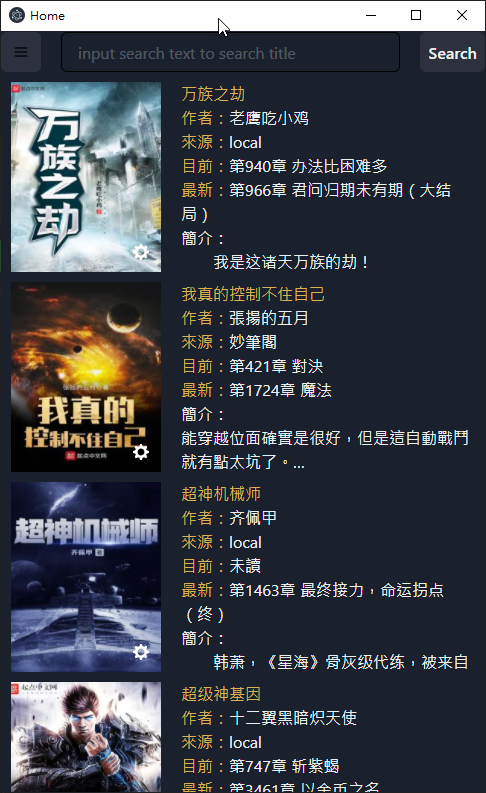
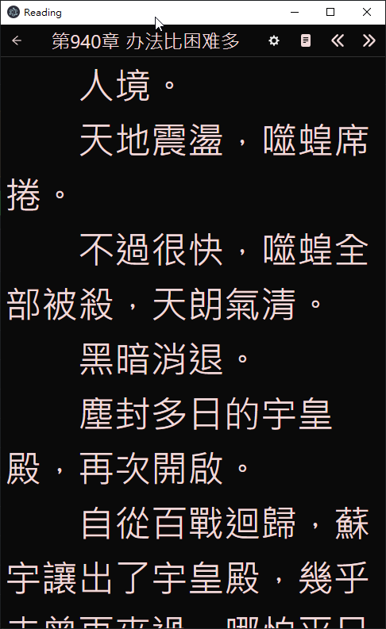

# Novel-Reader

小說閱讀器

# Feature

- [x] 載入txt格式的小說
- [x] 爬取特定網站的小說(目前支援 飄天,妙筆閣)
- [x] 閱讀頁面 顏色,字體大小 可自定義
- [x] 簡繁切換
- [x] 可使用瀏覽器閱讀
- [ ] 目前亦可自定爬取的網站但尚未完善,可參考程式目錄下`scraper`的檔案建立爬取規則

# 備份設定

備份以下檔案`C:/users/username/AppData/Local/JustReader/novel-reader.db`

# 注意

1. 目前使用 port 為 8088 , 如此port使用中則無法正常使用

# Requirement

1. [Node.js](https://nodejs.org/en/)
2. [Golang](https://golang.org/)

# build app

1. install dependency
    1. run `npm install`
    2. cd to go folder
    3. run go mod tiny
2. run `node build.js` in terminal , output folder is `build_electron`

[React build](React.md)  
[Go build](go%20build.md)

# 目前支援本地小說格式說明

[點我](docs/novel%20format.md)

# 程式畫面

